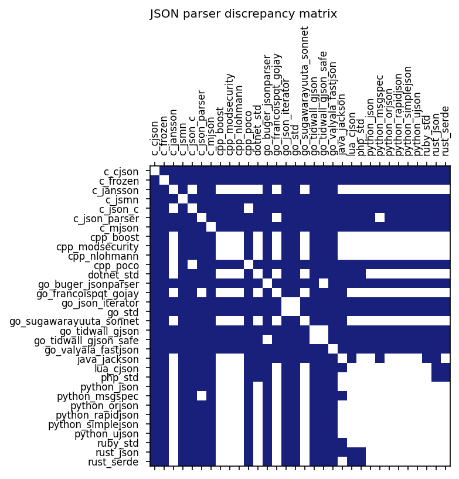

# Master's Thesis Proposal (draft)

**Cross-language parser interoperability**

**Student: Oula Kivalo**
**Supervisor: _\<?>_**

## Aim and Objectives
The aim of this thesis is to test the interoperability of different parser implementations across multiple programming languages through fuzz testing. While the rest of the proposal focuses on JSON parsers, the thesis can also focus on other protocols or data formats in case the supervisor prefers them.

JSON has become the de facto standard for data interchange on the internet. As such, multiple JSON parsers have been developed across different programming languages. With the rise of microservice-based cloud architectures, where small independent services often communicate via JSON, different parser implementations may be used to parse the same data. If an attacker can inject malicious JSON payloads into such communication, inconsistencies in parser behavior may enable privilege escalation, denial-of-service attacks, or other vulnerabilities\[4].

Despite the popularity of JSON, academic research on parser interoperability is surprisingly limited\[1]. Most prior work has been done by independent security researchers\[2]\[3].

## Goals and Contributions
This thesis aims to find parsing mismatches between parsers which may lead to vulnerabilities. The main contribution of the thesis will be a table similar as in [Results so far](#results-so-far), and other possible vulnerabilities found in individual parsers.

The goal is to test 30+ parsers across 6+ languages which will be selected from [json.org](https://json.org) and GitHub based on their popularity.

## Methodology
Research is done using a custom fuzzing application. If the time allows, further research will be done using Google's BigQuery to find open source applications using vulnerable JSON parsers. These can then be manually reviewed to see if the results found can lead to vulnerabilities in them.

### Work Completed So Far
This project contains a proof-of-concept fuzzing appliciation which is capable of testing some tens of millions of test cases per second across different languages and parsers.

The project consists of three main components:

* **Fuzzer**: A Rust-based application which generates test cases and distributes them to parser clients via TCP sockets. Test cases are based on templates defined in [./payloads.toml](payloads.toml) and mutated according to configuration parameters.

The fuzzer can still be optimized further and needs new features for more convoluted test cases.

* **Clients**: Each language has their own client which contains multiple different parsers. Currently, four clients are implemented for languages Rust, Go, Python, and C. These clients contain a total of 18 different parsers.

* **Analyzer**: A naive and limited implementation written in Rust. Compares the results produced by different parsers for each test case and saves interesting ones to `.csv` files for manual review.

Currently only finds the most obvious cases of where two parsers produce different outputs when parsing the same input.

### Preliminary Results
#### Cross-Library JSON Parsing Mismatches
The project has currently found 210 cases where parsers retrieve different values in JSON objects when querying for the same key. These cases are listed in the figure and table below.

*Figure 1: Parsing mismatches. The matrix has a cell colored in blue if the parsers labeled in the cell's column and row can access different values when querying the same key in the same JSON object.*

|P1|P2|JSON|P1\["q"]|P2\["q"]|
|-------|-------|----|:-----:|:-----:|
|[c_cjson](https://github.com/DaveGamble/cJSON)|[c_jansson](https://github.com/akheron/jansson)|{"q":3,"q":2}|3|2|
|[c_cjson](https://github.com/DaveGamble/cJSON)|[c_json_parser](https://github.com/json-parser/json-parser)|{"q":3,"q":2}|3|2|
|[c_cjson](https://github.com/DaveGamble/cJSON)|[go_buger_jsonparser](https://github.com/buger/jsonparser)|{"q\u0000":2,"q":3}|2|3|
|[c_cjson](https://github.com/DaveGamble/cJSON)|[go_francoispqt_gojay](https://github.com/francoispqt/gojay)|{"q":3,"q":2}|3|2|
|[c_cjson](https://github.com/DaveGamble/cJSON)|[go_json_iterator](https://github.com/json-iterator/go)|{"q":3,"q":2}|3|2|
|[c_cjson](https://github.com/DaveGamble/cJSON)|[go_std](https://pkg.go.dev/encoding/json)|{"q":3,"q":2}|3|2|
|[c_cjson](https://github.com/DaveGamble/cJSON)|[go_sugawarayuuta_sonnet](https://github.com/sugawarayuuta/sonnet)|{"q":3,"q":2}|3|2|
|[c_cjson](https://github.com/DaveGamble/cJSON)|[go_tidwall_gjson](https://github.com/tidwall/gjson)|{"q\u0000":2,"q":3}|2|3|
|[c_cjson](https://github.com/DaveGamble/cJSON)|[go_tidwall_gjson_safe](https://github.com/tidwall/gjson)|{"q\u0000":2,"q":3}|2|3|
|[c_cjson](https://github.com/DaveGamble/cJSON)|[go_valyala_fastjson](https://github.com/valyala/fastjson)|{"q\u0000":2,"q":3}|2|3|
|[c_cjson](https://github.com/DaveGamble/cJSON)|[python_json](https://docs.python.org/3/library/json.html)|{"q":3,"q":2}|3|2|
|[c_cjson](https://github.com/DaveGamble/cJSON)|[python_msgspec](https://github.com/jcrist/msgspec)|{"q":3,"q":2}|3|2|
|[c_cjson](https://github.com/DaveGamble/cJSON)|[python_orjson](https://github.com/ijl/orjson)|{"q":3,"q":2}|3|2|
|[c_cjson](https://github.com/DaveGamble/cJSON)|[python_simplejson](https://github.com/simplejson/simplejson)|{"q":3,"q":2}|3|2|
|[c_cjson](https://github.com/DaveGamble/cJSON)|[python_ujson](https://github.com/ultrajson/ultrajson)|{"q":3,"q":2}|3|2|
|[c_cjson](https://github.com/DaveGamble/cJSON)|[rust_json](https://github.com/maciejhirsz/json-rust)|{"q":3,"q":2}|3|2|
|[c_cjson](https://github.com/DaveGamble/cJSON)|[rust_serde](https://github.com/serde-rs/json)|{"q":3,"q":2}|3|2|
|[c_jansson](https://github.com/akheron/jansson)|[c_cjson](https://github.com/DaveGamble/cJSON)|{"q":3,"q":2}|2|3|
|[c_jansson](https://github.com/akheron/jansson)|[c_json_parser](https://github.com/json-parser/json-parser)|{"q":2," q":3}|2|3|
|[c_jansson](https://github.com/akheron/jansson)|[go_buger_jsonparser](https://github.com/buger/jsonparser)|{"q":3,"q":2}|2|3|
|[c_jansson](https://github.com/akheron/jansson)|[go_json_iterator](https://github.com/json-iterator/go)|{"q":2,"Q":3}|2|3|
|[c_jansson](https://github.com/akheron/jansson)|[go_std](https://pkg.go.dev/encoding/json)|{"q":2,"Q":3}|2|3|
|[c_jansson](https://github.com/akheron/jansson)|[go_tidwall_gjson](https://github.com/tidwall/gjson)|{"q":3,"q":2}|2|3|
|[c_jansson](https://github.com/akheron/jansson)|[go_tidwall_gjson_safe](https://github.com/tidwall/gjson)|{"q":3,"q":2}|2|3|
|[c_jansson](https://github.com/akheron/jansson)|[go_valyala_fastjson](https://github.com/valyala/fastjson)|{"q":3,"q":2}|2|3|
|[c_json_parser](https://github.com/json-parser/json-parser)|[c_cjson](https://github.com/DaveGamble/cJSON)|{"q":3,"q":2}|2|3|
|[c_json_parser](https://github.com/json-parser/json-parser)|[c_jansson](https://github.com/akheron/jansson)|{"q":2," q":3}|3|2|
|[c_json_parser](https://github.com/json-parser/json-parser)|[go_buger_jsonparser](https://github.com/buger/jsonparser)|{"q":3,"q":2}|2|3|
|[c_json_parser](https://github.com/json-parser/json-parser)|[go_francoispqt_gojay](https://github.com/francoispqt/gojay)|{"q":2,"\x01q":3}|3|2|
|[c_json_parser](https://github.com/json-parser/json-parser)|[go_json_iterator](https://github.com/json-iterator/go)|{"q":2,"\x01q":3}|3|2|
|[c_json_parser](https://github.com/json-parser/json-parser)|[go_std](https://pkg.go.dev/encoding/json)|{"q":2," q":3}|3|2|
|[c_json_parser](https://github.com/json-parser/json-parser)|[go_sugawarayuuta_sonnet](https://github.com/sugawarayuuta/sonnet)|{"q":2," q":3}|3|2|
|[c_json_parser](https://github.com/json-parser/json-parser)|[go_tidwall_gjson](https://github.com/tidwall/gjson)|{"q":3,"q":2}|2|3|
|[c_json_parser](https://github.com/json-parser/json-parser)|[go_tidwall_gjson_safe](https://github.com/tidwall/gjson)|{"q":3,"q":2}|2|3|
|[c_json_parser](https://github.com/json-parser/json-parser)|[go_valyala_fastjson](https://github.com/valyala/fastjson)|{"q":3,"q":2}|2|3|
|[c_json_parser](https://github.com/json-parser/json-parser)|[python_json](https://docs.python.org/3/library/json.html)|{"q":2," q":3}|3|2|
|[c_json_parser](https://github.com/json-parser/json-parser)|[python_msgspec](https://github.com/jcrist/msgspec)|{"q":2," q":3}|3|2|
|[c_json_parser](https://github.com/json-parser/json-parser)|[python_orjson](https://github.com/ijl/orjson)|{"q":2," q":3}|3|2|
|[c_json_parser](https://github.com/json-parser/json-parser)|[python_simplejson](https://github.com/simplejson/simplejson)|{"q":2," q":3}|3|2|
|[c_json_parser](https://github.com/json-parser/json-parser)|[python_ujson](https://github.com/ultrajson/ultrajson)|{"q":2,"\x01q":3}|3|2|
|[c_json_parser](https://github.com/json-parser/json-parser)|[rust_json](https://github.com/maciejhirsz/json-rust)|{"q":2," q":3}|3|2|
|[c_json_parser](https://github.com/json-parser/json-parser)|[rust_serde](https://github.com/serde-rs/json)|{"q":2," q":3}|3|2|
|[go_buger_jsonparser](https://github.com/buger/jsonparser)|[c_cjson](https://github.com/DaveGamble/cJSON)|{"q\u0000":2,"q":3}|3|2|
|[go_buger_jsonparser](https://github.com/buger/jsonparser)|[c_jansson](https://github.com/akheron/jansson)|{"q":3,"q":2}|3|2|
|[go_buger_jsonparser](https://github.com/buger/jsonparser)|[c_json_parser](https://github.com/json-parser/json-parser)|{"q":3,"q":2}|3|2|
|[go_buger_jsonparser](https://github.com/buger/jsonparser)|[go_francoispqt_gojay](https://github.com/francoispqt/gojay)|\t{"q":2,"q":3}|2|3|
|[go_buger_jsonparser](https://github.com/buger/jsonparser)|[go_json_iterator](https://github.com/json-iterator/go)|{"q":3,"q":2}|3|2|
|[go_buger_jsonparser](https://github.com/buger/jsonparser)|[go_std](https://pkg.go.dev/encoding/json)|{"q":3,"q":2}|3|2|
|[go_buger_jsonparser](https://github.com/buger/jsonparser)|[go_sugawarayuuta_sonnet](https://github.com/sugawarayuuta/sonnet)|{"q":3,"q":2}|3|2|
|[go_buger_jsonparser](https://github.com/buger/jsonparser)|[go_tidwall_gjson](https://github.com/tidwall/gjson)|{"""q":2,"q":3}|2|3|
|[go_buger_jsonparser](https://github.com/buger/jsonparser)|[go_valyala_fastjson](https://github.com/valyala/fastjson)|{"\u0071":2,"q":3}|2|3|
|[go_buger_jsonparser](https://github.com/buger/jsonparser)|[python_json](https://docs.python.org/3/library/json.html)|{"q":3,"q":2}|3|2|
|[go_buger_jsonparser](https://github.com/buger/jsonparser)|[python_msgspec](https://github.com/jcrist/msgspec)|{"q":3,"q":2}|3|2|
|[go_buger_jsonparser](https://github.com/buger/jsonparser)|[python_orjson](https://github.com/ijl/orjson)|{"q":3,"q":2}|3|2|
|[go_buger_jsonparser](https://github.com/buger/jsonparser)|[python_simplejson](https://github.com/simplejson/simplejson)|{"q":3,"q":2}|3|2|
|[go_buger_jsonparser](https://github.com/buger/jsonparser)|[python_ujson](https://github.com/ultrajson/ultrajson)|{"q":3,"q":2}|3|2|
|[go_buger_jsonparser](https://github.com/buger/jsonparser)|[rust_json](https://github.com/maciejhirsz/json-rust)|{"q":3,"q":2}|3|2|
|[go_buger_jsonparser](https://github.com/buger/jsonparser)|[rust_serde](https://github.com/serde-rs/json)|{"q":3,"q":2}|3|2|
|[go_francoispqt_gojay](https://github.com/francoispqt/gojay)|[c_cjson](https://github.com/DaveGamble/cJSON)|{"q":3,"q":2}|2|3|
|[go_francoispqt_gojay](https://github.com/francoispqt/gojay)|[c_json_parser](https://github.com/json-parser/json-parser)|{"q":2,"\x01q":3}|2|3|
|[go_francoispqt_gojay](https://github.com/francoispqt/gojay)|[go_buger_jsonparser](https://github.com/buger/jsonparser)|{"q"":2,""q":3}|2|3|
|[go_francoispqt_gojay](https://github.com/francoispqt/gojay)|[go_json_iterator](https://github.com/json-iterator/go)|{"q":2,"Q":3}|2|3|
|[go_francoispqt_gojay](https://github.com/francoispqt/gojay)|[go_std](https://pkg.go.dev/encoding/json)|{"q":2,"Q":3}|2|3|
|[go_francoispqt_gojay](https://github.com/francoispqt/gojay)|[go_tidwall_gjson](https://github.com/tidwall/gjson)|{"q":3,"q":2}|2|3|
|[go_francoispqt_gojay](https://github.com/francoispqt/gojay)|[go_tidwall_gjson_safe](https://github.com/tidwall/gjson)|{"q":3,"q":2}|2|3|
|[go_francoispqt_gojay](https://github.com/francoispqt/gojay)|[go_valyala_fastjson](https://github.com/valyala/fastjson)|{"q":3,"q":2}|2|3|
|[go_json_iterator](https://github.com/json-iterator/go)|[c_cjson](https://github.com/DaveGamble/cJSON)|{"q":3,"q":2}|2|3|
|[go_json_iterator](https://github.com/json-iterator/go)|[c_jansson](https://github.com/akheron/jansson)|{"q":2,"Q":3}|3|2|
|[go_json_iterator](https://github.com/json-iterator/go)|[c_json_parser](https://github.com/json-parser/json-parser)|{"q":2,"\x01q":3}|2|3|
|[go_json_iterator](https://github.com/json-iterator/go)|[go_buger_jsonparser](https://github.com/buger/jsonparser)|{"q":3,"q":2}|2|3|
|[go_json_iterator](https://github.com/json-iterator/go)|[go_francoispqt_gojay](https://github.com/francoispqt/gojay)|{"q":2,"Q":3}|3|2|
|[go_json_iterator](https://github.com/json-iterator/go)|[go_sugawarayuuta_sonnet](https://github.com/sugawarayuuta/sonnet)|{"q":2,"Q":3}|3|2|
|[go_json_iterator](https://github.com/json-iterator/go)|[go_tidwall_gjson](https://github.com/tidwall/gjson)|{"q":3,"q":2}|2|3|
|[go_json_iterator](https://github.com/json-iterator/go)|[go_tidwall_gjson_safe](https://github.com/tidwall/gjson)|{"q":3,"q":2}|2|3|
|[go_json_iterator](https://github.com/json-iterator/go)|[go_valyala_fastjson](https://github.com/valyala/fastjson)|{"q":3,"q":2}|2|3|
|[go_json_iterator](https://github.com/json-iterator/go)|[python_json](https://docs.python.org/3/library/json.html)|{"q":2,"Q":3}|3|2|
|[go_json_iterator](https://github.com/json-iterator/go)|[python_msgspec](https://github.com/jcrist/msgspec)|{"q":2,"Q":3}|3|2|
|[go_json_iterator](https://github.com/json-iterator/go)|[python_orjson](https://github.com/ijl/orjson)|{"q":2,"Q":3}|3|2|
|[go_json_iterator](https://github.com/json-iterator/go)|[python_simplejson](https://github.com/simplejson/simplejson)|{"q":2,"Q":3}|3|2|
|[go_json_iterator](https://github.com/json-iterator/go)|[python_ujson](https://github.com/ultrajson/ultrajson)|{"q":2,"Q":3}|3|2|
|[go_json_iterator](https://github.com/json-iterator/go)|[rust_json](https://github.com/maciejhirsz/json-rust)|{"q":2,"Q":3}|3|2|
|[go_json_iterator](https://github.com/json-iterator/go)|[rust_serde](https://github.com/serde-rs/json)|{"q":2,"Q":3}|3|2|
|[go_std](https://pkg.go.dev/encoding/json)|[c_cjson](https://github.com/DaveGamble/cJSON)|{"q":3,"q":2}|2|3|
|[go_std](https://pkg.go.dev/encoding/json)|[c_jansson](https://github.com/akheron/jansson)|{"q":2,"Q":3}|3|2|
|[go_std](https://pkg.go.dev/encoding/json)|[c_json_parser](https://github.com/json-parser/json-parser)|{"q":2," q":3}|2|3|
|[go_std](https://pkg.go.dev/encoding/json)|[go_buger_jsonparser](https://github.com/buger/jsonparser)|{"q":3,"q":2}|2|3|
|[go_std](https://pkg.go.dev/encoding/json)|[go_francoispqt_gojay](https://github.com/francoispqt/gojay)|{"q":2,"Q":3}|3|2|
|[go_std](https://pkg.go.dev/encoding/json)|[go_sugawarayuuta_sonnet](https://github.com/sugawarayuuta/sonnet)|{"q":2,"Q":3}|3|2|
|[go_std](https://pkg.go.dev/encoding/json)|[go_tidwall_gjson](https://github.com/tidwall/gjson)|{"q":3,"q":2}|2|3|
|[go_std](https://pkg.go.dev/encoding/json)|[go_tidwall_gjson_safe](https://github.com/tidwall/gjson)|{"q":3,"q":2}|2|3|
|[go_std](https://pkg.go.dev/encoding/json)|[go_valyala_fastjson](https://github.com/valyala/fastjson)|{"q":3,"q":2}|2|3|
|[go_std](https://pkg.go.dev/encoding/json)|[python_json](https://docs.python.org/3/library/json.html)|{"q":2,"Q":3}|3|2|
|[go_std](https://pkg.go.dev/encoding/json)|[python_msgspec](https://github.com/jcrist/msgspec)|{"q":2,"Q":3}|3|2|
|[go_std](https://pkg.go.dev/encoding/json)|[python_orjson](https://github.com/ijl/orjson)|{"q":2,"Q":3}|3|2|
|[go_std](https://pkg.go.dev/encoding/json)|[python_simplejson](https://github.com/simplejson/simplejson)|{"q":2,"Q":3}|3|2|
|[go_std](https://pkg.go.dev/encoding/json)|[python_ujson](https://github.com/ultrajson/ultrajson)|{"q":2,"Q":3}|3|2|
|[go_std](https://pkg.go.dev/encoding/json)|[rust_json](https://github.com/maciejhirsz/json-rust)|{"q":2,"Q":3}|3|2|
|[go_std](https://pkg.go.dev/encoding/json)|[rust_serde](https://github.com/serde-rs/json)|{"q":2,"Q":3}|3|2|
|[go_sugawarayuuta_sonnet](https://github.com/sugawarayuuta/sonnet)|[c_cjson](https://github.com/DaveGamble/cJSON)|{"q":3,"q":2}|2|3|
|[go_sugawarayuuta_sonnet](https://github.com/sugawarayuuta/sonnet)|[c_json_parser](https://github.com/json-parser/json-parser)|{"q":2," q":3}|2|3|
|[go_sugawarayuuta_sonnet](https://github.com/sugawarayuuta/sonnet)|[go_buger_jsonparser](https://github.com/buger/jsonparser)|{"q":3,"q":2}|2|3|
|[go_sugawarayuuta_sonnet](https://github.com/sugawarayuuta/sonnet)|[go_json_iterator](https://github.com/json-iterator/go)|{"q":2,"Q":3}|2|3|
|[go_sugawarayuuta_sonnet](https://github.com/sugawarayuuta/sonnet)|[go_std](https://pkg.go.dev/encoding/json)|{"q":2,"Q":3}|2|3|
|[go_sugawarayuuta_sonnet](https://github.com/sugawarayuuta/sonnet)|[go_tidwall_gjson](https://github.com/tidwall/gjson)|{"q":3,"q":2}|2|3|
|[go_sugawarayuuta_sonnet](https://github.com/sugawarayuuta/sonnet)|[go_tidwall_gjson_safe](https://github.com/tidwall/gjson)|{"q":3,"q":2}|2|3|
|[go_sugawarayuuta_sonnet](https://github.com/sugawarayuuta/sonnet)|[go_valyala_fastjson](https://github.com/valyala/fastjson)|{"q":3,"q":2}|2|3|
|[go_tidwall_gjson](https://github.com/tidwall/gjson)|[c_cjson](https://github.com/DaveGamble/cJSON)|{"q\u0000":2,"q":3}|3|2|
|[go_tidwall_gjson](https://github.com/tidwall/gjson)|[c_jansson](https://github.com/akheron/jansson)|{"q":3,"q":2}|3|2|
|[go_tidwall_gjson](https://github.com/tidwall/gjson)|[c_json_parser](https://github.com/json-parser/json-parser)|{"q":3,"q":2}|3|2|
|[go_tidwall_gjson](https://github.com/tidwall/gjson)|[go_buger_jsonparser](https://github.com/buger/jsonparser)|{["q":]2,"q":3}|2|3|
|[go_tidwall_gjson](https://github.com/tidwall/gjson)|[go_francoispqt_gojay](https://github.com/francoispqt/gojay)|{"q":3,"q":2}|3|2|
|[go_tidwall_gjson](https://github.com/tidwall/gjson)|[go_json_iterator](https://github.com/json-iterator/go)|{"q":3,"q":2}|3|2|
|[go_tidwall_gjson](https://github.com/tidwall/gjson)|[go_std](https://pkg.go.dev/encoding/json)|{"q":3,"q":2}|3|2|
|[go_tidwall_gjson](https://github.com/tidwall/gjson)|[go_sugawarayuuta_sonnet](https://github.com/sugawarayuuta/sonnet)|{"q":3,"q":2}|3|2|
|[go_tidwall_gjson](https://github.com/tidwall/gjson)|[go_valyala_fastjson](https://github.com/valyala/fastjson)|{"q\q":2,"q":3}|2|3|
|[go_tidwall_gjson](https://github.com/tidwall/gjson)|[python_json](https://docs.python.org/3/library/json.html)|{"q":3,"q":2}|3|2|
|[go_tidwall_gjson](https://github.com/tidwall/gjson)|[python_msgspec](https://github.com/jcrist/msgspec)|{"q":3,"q":2}|3|2|
|[go_tidwall_gjson](https://github.com/tidwall/gjson)|[python_orjson](https://github.com/ijl/orjson)|{"q":3,"q":2}|3|2|
|[go_tidwall_gjson](https://github.com/tidwall/gjson)|[python_simplejson](https://github.com/simplejson/simplejson)|{"q":3,"q":2}|3|2|
|[go_tidwall_gjson](https://github.com/tidwall/gjson)|[python_ujson](https://github.com/ultrajson/ultrajson)|{"q":3,"q":2}|3|2|
|[go_tidwall_gjson](https://github.com/tidwall/gjson)|[rust_json](https://github.com/maciejhirsz/json-rust)|{"q":3,"q":2}|3|2|
|[go_tidwall_gjson](https://github.com/tidwall/gjson)|[rust_serde](https://github.com/serde-rs/json)|{"q":3,"q":2}|3|2|
|[go_tidwall_gjson_safe](https://github.com/tidwall/gjson)|[c_cjson](https://github.com/DaveGamble/cJSON)|{"q\u0000":2,"q":3}|3|2|
|[go_tidwall_gjson_safe](https://github.com/tidwall/gjson)|[c_jansson](https://github.com/akheron/jansson)|{"q":3,"q":2}|3|2|
|[go_tidwall_gjson_safe](https://github.com/tidwall/gjson)|[c_json_parser](https://github.com/json-parser/json-parser)|{"q":3,"q":2}|3|2|
|[go_tidwall_gjson_safe](https://github.com/tidwall/gjson)|[go_francoispqt_gojay](https://github.com/francoispqt/gojay)|{"q":3,"q":2}|3|2|
|[go_tidwall_gjson_safe](https://github.com/tidwall/gjson)|[go_json_iterator](https://github.com/json-iterator/go)|{"q":3,"q":2}|3|2|
|[go_tidwall_gjson_safe](https://github.com/tidwall/gjson)|[go_std](https://pkg.go.dev/encoding/json)|{"q":3,"q":2}|3|2|
|[go_tidwall_gjson_safe](https://github.com/tidwall/gjson)|[go_sugawarayuuta_sonnet](https://github.com/sugawarayuuta/sonnet)|{"q":3,"q":2}|3|2|
|[go_tidwall_gjson_safe](https://github.com/tidwall/gjson)|[go_valyala_fastjson](https://github.com/valyala/fastjson)|{"\u0071":2,"q":3}|2|3|
|[go_tidwall_gjson_safe](https://github.com/tidwall/gjson)|[python_json](https://docs.python.org/3/library/json.html)|{"q":3,"q":2}|3|2|
|[go_tidwall_gjson_safe](https://github.com/tidwall/gjson)|[python_msgspec](https://github.com/jcrist/msgspec)|{"q":3,"q":2}|3|2|
|[go_tidwall_gjson_safe](https://github.com/tidwall/gjson)|[python_orjson](https://github.com/ijl/orjson)|{"q":3,"q":2}|3|2|
|[go_tidwall_gjson_safe](https://github.com/tidwall/gjson)|[python_simplejson](https://github.com/simplejson/simplejson)|{"q":3,"q":2}|3|2|
|[go_tidwall_gjson_safe](https://github.com/tidwall/gjson)|[python_ujson](https://github.com/ultrajson/ultrajson)|{"q":3,"q":2}|3|2|
|[go_tidwall_gjson_safe](https://github.com/tidwall/gjson)|[rust_json](https://github.com/maciejhirsz/json-rust)|{"q":3,"q":2}|3|2|
|[go_tidwall_gjson_safe](https://github.com/tidwall/gjson)|[rust_serde](https://github.com/serde-rs/json)|{"q":3,"q":2}|3|2|
|[go_valyala_fastjson](https://github.com/valyala/fastjson)|[c_cjson](https://github.com/DaveGamble/cJSON)|{"q\u0000":2,"q":3}|3|2|
|[go_valyala_fastjson](https://github.com/valyala/fastjson)|[c_jansson](https://github.com/akheron/jansson)|{"q":3,"q":2}|3|2|
|[go_valyala_fastjson](https://github.com/valyala/fastjson)|[c_json_parser](https://github.com/json-parser/json-parser)|{"q":3,"q":2}|3|2|
|[go_valyala_fastjson](https://github.com/valyala/fastjson)|[go_buger_jsonparser](https://github.com/buger/jsonparser)|{"\u0071":2,"q":3}|3|2|
|[go_valyala_fastjson](https://github.com/valyala/fastjson)|[go_francoispqt_gojay](https://github.com/francoispqt/gojay)|{"q":3,"q":2}|3|2|
|[go_valyala_fastjson](https://github.com/valyala/fastjson)|[go_json_iterator](https://github.com/json-iterator/go)|{"q":3,"q":2}|3|2|
|[go_valyala_fastjson](https://github.com/valyala/fastjson)|[go_std](https://pkg.go.dev/encoding/json)|{"q":3,"q":2}|3|2|
|[go_valyala_fastjson](https://github.com/valyala/fastjson)|[go_sugawarayuuta_sonnet](https://github.com/sugawarayuuta/sonnet)|{"q":3,"q":2}|3|2|
|[go_valyala_fastjson](https://github.com/valyala/fastjson)|[go_tidwall_gjson](https://github.com/tidwall/gjson)|{"q\q":2,"q":3}|3|2|
|[go_valyala_fastjson](https://github.com/valyala/fastjson)|[go_tidwall_gjson_safe](https://github.com/tidwall/gjson)|{"\u0071":2,"q":3}|3|2|
|[go_valyala_fastjson](https://github.com/valyala/fastjson)|[python_json](https://docs.python.org/3/library/json.html)|{"q":3,"q":2}|3|2|
|[go_valyala_fastjson](https://github.com/valyala/fastjson)|[python_msgspec](https://github.com/jcrist/msgspec)|{"q":3,"q":2}|3|2|
|[go_valyala_fastjson](https://github.com/valyala/fastjson)|[python_orjson](https://github.com/ijl/orjson)|{"q":3,"q":2}|3|2|
|[go_valyala_fastjson](https://github.com/valyala/fastjson)|[python_simplejson](https://github.com/simplejson/simplejson)|{"q":3,"q":2}|3|2|
|[go_valyala_fastjson](https://github.com/valyala/fastjson)|[python_ujson](https://github.com/ultrajson/ultrajson)|{"q":3,"q":2}|3|2|
|[go_valyala_fastjson](https://github.com/valyala/fastjson)|[rust_json](https://github.com/maciejhirsz/json-rust)|{"q":3,"q":2}|3|2|
|[go_valyala_fastjson](https://github.com/valyala/fastjson)|[rust_serde](https://github.com/serde-rs/json)|{"q":3,"q":2}|3|2|
|[python_json](https://docs.python.org/3/library/json.html)|[c_cjson](https://github.com/DaveGamble/cJSON)|{"q":3,"q":2}|2|3|
|[python_json](https://docs.python.org/3/library/json.html)|[c_json_parser](https://github.com/json-parser/json-parser)|{"q":2," q":3}|2|3|
|[python_json](https://docs.python.org/3/library/json.html)|[go_buger_jsonparser](https://github.com/buger/jsonparser)|{"q":3,"q":2}|2|3|
|[python_json](https://docs.python.org/3/library/json.html)|[go_json_iterator](https://github.com/json-iterator/go)|{"q":2,"Q":3}|2|3|
|[python_json](https://docs.python.org/3/library/json.html)|[go_std](https://pkg.go.dev/encoding/json)|{"q":2,"Q":3}|2|3|
|[python_json](https://docs.python.org/3/library/json.html)|[go_tidwall_gjson](https://github.com/tidwall/gjson)|{"q":3,"q":2}|2|3|
|[python_json](https://docs.python.org/3/library/json.html)|[go_tidwall_gjson_safe](https://github.com/tidwall/gjson)|{"q":3,"q":2}|2|3|
|[python_json](https://docs.python.org/3/library/json.html)|[go_valyala_fastjson](https://github.com/valyala/fastjson)|{"q":3,"q":2}|2|3|
|[python_msgspec](https://github.com/jcrist/msgspec)|[c_cjson](https://github.com/DaveGamble/cJSON)|{"q":3,"q":2}|2|3|
|[python_msgspec](https://github.com/jcrist/msgspec)|[c_json_parser](https://github.com/json-parser/json-parser)|{"q":2," q":3}|2|3|
|[python_msgspec](https://github.com/jcrist/msgspec)|[go_buger_jsonparser](https://github.com/buger/jsonparser)|{"q":3,"q":2}|2|3|
|[python_msgspec](https://github.com/jcrist/msgspec)|[go_json_iterator](https://github.com/json-iterator/go)|{"q":2,"Q":3}|2|3|
|[python_msgspec](https://github.com/jcrist/msgspec)|[go_std](https://pkg.go.dev/encoding/json)|{"q":2,"Q":3}|2|3|
|[python_msgspec](https://github.com/jcrist/msgspec)|[go_tidwall_gjson](https://github.com/tidwall/gjson)|{"q":3,"q":2}|2|3|
|[python_msgspec](https://github.com/jcrist/msgspec)|[go_tidwall_gjson_safe](https://github.com/tidwall/gjson)|{"q":3,"q":2}|2|3|
|[python_msgspec](https://github.com/jcrist/msgspec)|[go_valyala_fastjson](https://github.com/valyala/fastjson)|{"q":3,"q":2}|2|3|
|[python_orjson](https://github.com/ijl/orjson)|[c_cjson](https://github.com/DaveGamble/cJSON)|{"q":3,"q":2}|2|3|
|[python_orjson](https://github.com/ijl/orjson)|[c_json_parser](https://github.com/json-parser/json-parser)|{"q":2," q":3}|2|3|
|[python_orjson](https://github.com/ijl/orjson)|[go_buger_jsonparser](https://github.com/buger/jsonparser)|{"q":3,"q":2}|2|3|
|[python_orjson](https://github.com/ijl/orjson)|[go_json_iterator](https://github.com/json-iterator/go)|{"q":2,"Q":3}|2|3|
|[python_orjson](https://github.com/ijl/orjson)|[go_std](https://pkg.go.dev/encoding/json)|{"q":2,"Q":3}|2|3|
|[python_orjson](https://github.com/ijl/orjson)|[go_tidwall_gjson](https://github.com/tidwall/gjson)|{"q":3,"q":2}|2|3|
|[python_orjson](https://github.com/ijl/orjson)|[go_tidwall_gjson_safe](https://github.com/tidwall/gjson)|{"q":3,"q":2}|2|3|
|[python_orjson](https://github.com/ijl/orjson)|[go_valyala_fastjson](https://github.com/valyala/fastjson)|{"q":3,"q":2}|2|3|
|[python_simplejson](https://github.com/simplejson/simplejson)|[c_cjson](https://github.com/DaveGamble/cJSON)|{"q":3,"q":2}|2|3|
|[python_simplejson](https://github.com/simplejson/simplejson)|[c_json_parser](https://github.com/json-parser/json-parser)|{"q":2," q":3}|2|3|
|[python_simplejson](https://github.com/simplejson/simplejson)|[go_buger_jsonparser](https://github.com/buger/jsonparser)|{"q":3,"q":2}|2|3|
|[python_simplejson](https://github.com/simplejson/simplejson)|[go_json_iterator](https://github.com/json-iterator/go)|{"q":2,"Q":3}|2|3|
|[python_simplejson](https://github.com/simplejson/simplejson)|[go_std](https://pkg.go.dev/encoding/json)|{"q":2,"Q":3}|2|3|
|[python_simplejson](https://github.com/simplejson/simplejson)|[go_tidwall_gjson](https://github.com/tidwall/gjson)|{"q":3,"q":2}|2|3|
|[python_simplejson](https://github.com/simplejson/simplejson)|[go_tidwall_gjson_safe](https://github.com/tidwall/gjson)|{"q":3,"q":2}|2|3|
|[python_simplejson](https://github.com/simplejson/simplejson)|[go_valyala_fastjson](https://github.com/valyala/fastjson)|{"q":3,"q":2}|2|3|
|[python_ujson](https://github.com/ultrajson/ultrajson)|[c_cjson](https://github.com/DaveGamble/cJSON)|{"q":3,"q":2}|2|3|
|[python_ujson](https://github.com/ultrajson/ultrajson)|[c_json_parser](https://github.com/json-parser/json-parser)|{"q":2,"\x01q":3}|2|3|
|[python_ujson](https://github.com/ultrajson/ultrajson)|[go_buger_jsonparser](https://github.com/buger/jsonparser)|{"q":3,"q":2}|2|3|
|[python_ujson](https://github.com/ultrajson/ultrajson)|[go_json_iterator](https://github.com/json-iterator/go)|{"q":2,"Q":3}|2|3|
|[python_ujson](https://github.com/ultrajson/ultrajson)|[go_std](https://pkg.go.dev/encoding/json)|{"q":2,"Q":3}|2|3|
|[python_ujson](https://github.com/ultrajson/ultrajson)|[go_tidwall_gjson](https://github.com/tidwall/gjson)|{"q":3,"q":2}|2|3|
|[python_ujson](https://github.com/ultrajson/ultrajson)|[go_tidwall_gjson_safe](https://github.com/tidwall/gjson)|{"q":3,"q":2}|2|3|
|[python_ujson](https://github.com/ultrajson/ultrajson)|[go_valyala_fastjson](https://github.com/valyala/fastjson)|{"q":3,"q":2}|2|3|
|[rust_json](https://github.com/maciejhirsz/json-rust)|[c_cjson](https://github.com/DaveGamble/cJSON)|{"q":3,"q":2}|2|3|
|[rust_json](https://github.com/maciejhirsz/json-rust)|[c_json_parser](https://github.com/json-parser/json-parser)|{"q":2," q":3}|2|3|
|[rust_json](https://github.com/maciejhirsz/json-rust)|[go_buger_jsonparser](https://github.com/buger/jsonparser)|{"q":3,"q":2}|2|3|
|[rust_json](https://github.com/maciejhirsz/json-rust)|[go_json_iterator](https://github.com/json-iterator/go)|{"q":2,"Q":3}|2|3|
|[rust_json](https://github.com/maciejhirsz/json-rust)|[go_std](https://pkg.go.dev/encoding/json)|{"q":2,"Q":3}|2|3|
|[rust_json](https://github.com/maciejhirsz/json-rust)|[go_tidwall_gjson](https://github.com/tidwall/gjson)|{"q":3,"q":2}|2|3|
|[rust_json](https://github.com/maciejhirsz/json-rust)|[go_tidwall_gjson_safe](https://github.com/tidwall/gjson)|{"q":3,"q":2}|2|3|
|[rust_json](https://github.com/maciejhirsz/json-rust)|[go_valyala_fastjson](https://github.com/valyala/fastjson)|{"q":3,"q":2}|2|3|
|[rust_serde](https://github.com/serde-rs/json)|[c_cjson](https://github.com/DaveGamble/cJSON)|{"q":3,"q":2}|2|3|
|[rust_serde](https://github.com/serde-rs/json)|[c_json_parser](https://github.com/json-parser/json-parser)|{"q":2," q":3}|2|3|
|[rust_serde](https://github.com/serde-rs/json)|[go_buger_jsonparser](https://github.com/buger/jsonparser)|{"q":3,"q":2}|2|3|
|[rust_serde](https://github.com/serde-rs/json)|[go_json_iterator](https://github.com/json-iterator/go)|{"q":2,"Q":3}|2|3|
|[rust_serde](https://github.com/serde-rs/json)|[go_std](https://pkg.go.dev/encoding/json)|{"q":2,"Q":3}|2|3|
|[rust_serde](https://github.com/serde-rs/json)|[go_tidwall_gjson](https://github.com/tidwall/gjson)|{"q":3,"q":2}|2|3|
|[rust_serde](https://github.com/serde-rs/json)|[go_tidwall_gjson_safe](https://github.com/tidwall/gjson)|{"q":3,"q":2}|2|3|
|[rust_serde](https://github.com/serde-rs/json)|[go_valyala_fastjson](https://github.com/valyala/fastjson)|{"q":3,"q":2}|2|3|

*Table 1: Parsing mismatches. P1 and P2 refers to different parsers while P1\["q"] and P2\["q"] refers to what value the parsers access under key "q"*

## Schedule
TODO - for now I'm aiming to complete the thesis between December and March. The initial plan is to use one month for programming the fuzzer and the parsers, and the rest of the time for analyzing the gathered data and writing the paper.

## References
\[1] [https://dl.acm.org/doi/abs/10.1145/3634737.3657003](https://dl.acm.org/doi/abs/10.1145/3634737.3657003)
\[2] [https://bishopfox.com/blog/json-interoperability-vulnerabilities](https://bishopfox.com/blog/json-interoperability-vulnerabilities)
\[3] [https://seriot.ch/projects/parsing\_json.html](https://seriot.ch/projects/parsing_json.html)
\[4] [https://justi.cz/security/2017/11/14/couchdb-rce-npm.html](https://justi.cz/security/2017/11/14/couchdb-rce-npm.html)

