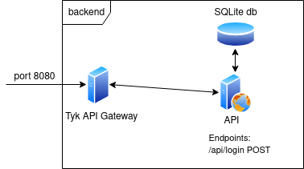
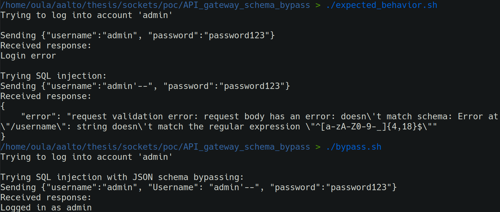

# Tyk API gateway JSON schema validation bypass
Tyk is an API gateway which can be used to access multiple internal API's through a single external access point\[1]. It can be configured from a single OpenAPI document which provides information on how an API is structured and how it can be interacted with\[2]. Additionally, Tyk can be used to validate requests and responses going through it based on schemas defined in the OpenAPI document.

## Hypothetical scenario
A login API is accessible thgough Tyk as shown in Figure 1. Tyk validates login information using JSON schemas contained in an OpenAPI document. In this scenario, the API developer believes the login information to be validated and passes it unsafely to an SQL query.

Due to Golang standard library JSON parser being case-insensitive, the schema validation can be bypassed by passing additional capitalized key-value pairs to the API.

To run the hypothetical scenario, install docker and run the following commands (In linux or WSL):

```
docker compose up --build -d
./update_tyk.sh
./expected_behavior.sh
./bypass.sh
```

This sets up the following architecture:



*Figure 1: Hypothetical scenario architecture*

The two bash scripts showcase the vulnerability. Their output can be seen in the figure below.



*Figure 2: Output from two login scripts; expected_behavior.sh and bypass.sh. The first shows how SQL injection is blocked by Tyk, while the second shows how it can be bypassed.*

## References:

\[1] [https://tyk.io/](https://tyk.io/)

\[2] [https://swagger.io/specification/](https://swagger.io/specification/)

